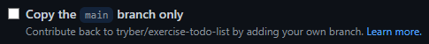

# Boas vindas ao desafio de Styled Components

---

# Orientações

  
<strong>‼️ Antes de começar a desenvolver</strong>
 

- Crie um fork desse projeto, para isso siga esse [tutorial de como realizar um fork](https://guides.github.com/activities/forking/).
  
  > **De olho na dica 👀:** Ao realizar o fork, o GitHub, por padrão, copia apenas a branch main. Caso queira realizar o fork copiando as demais branches, é necessário desmarcar a opção _copy the `main` branch only_.

  

- Após fazer o fork, clone o repositório criado para o seu computador.

- Rode o comando `npm install`.

 

  
<strong>🤝 Depois de terminar o desenvolvimento</strong>
 

Após a solução dos exercícios, abra um PR no seu repositório forkado e, se quiser, mergeie para a `main`. Sinta-se à vontade!

> **Atenção ⚠️:** Ao criar o PR,  você irá se deparar com essa tela:

É necessário realizar uma mudança. Para isso, clique no _base repository_ como na imagem abaixo:

Mude para o seu repositório. Seu nome estará na frente do nome dele, por exemplo: `antonio/TicTacToe`. Depois desse passo a página deve ficar assim:

Agora, basta criar o PULL REQUEST clicando no botão `Create Pull Request`.

 

# Exercício

> **Atenção ⚠️:** Antes realizar o exercício, é importante que você instale as dependências do projeto com o comando `npm install`.

**1** - Você deve implementar uma estilização para a aplicação desse repositório utilizando Styled Components. A estilização deve ser o mais próxima possível do layout disponível na pasta `src/design` na versão desktop, implementando inclusive os temas `dark` e `light`.
